# Harvest-Party

*Where music, food, and data come together—an interactive analysis of a D.C. fundraiser.*

🔗 [Live Website](https://www.harvestpartydc.com/)  
🔗 [Tableau Dashboard](https://public.tableau.com/app/profile/bryan.johns6699/viz/HarvestParty/HarvestPartyStory)  
🔗 [Exploratory Data Analysis (EDA)](https://colab.research.google.com/drive/123nofMYi7z7l8IldtLYO9ns2wDWzKHCE?usp=sharing)

> ℹ️ Status: While not under active development, data and dashboards are updated annually.

## Table of Contents

- [Project Overview](#project-overview)
- [Features](#features)
- [Tools & Technologies](#tools--technologies)
- [Usage](#usage)
- [Gallery](#gallery)
- [Course Certificate](#course-certificate)
- [References](#references)
- [Acknowledgements](#acknowledgements)
- [Author](#author)

## Project Overview

**Harvest Party** is a data-driven look at an annual D.C.-based fundraiser supporting the [Capital Area Food Bank](https://www.capitalareafoodbank.org/). Starting with a chaotic Google Sheet, this project cleans and transforms the data into:

- A Python-based exploratory data analysis (EDA)
- A story-style Tableau dashboard
- A responsive public website with interactive visualizations

Originally a fun side project, it now doubles as a case study in real-world data wrangling and design-driven storytelling. 

Names have been changed to protect the guilty.

## Features

- Dynamic visuals with hover + click interactivity
- Tableau dashboard with desktop and mobile versions
- Donation vs. expense comparisons over time
- Estimated cost per attendee (even with sketchy Facebook data)
- Custom SASS styling with thematic flair (including COVID-era mask animations)
- Locale-aware number formatting for global audiences

## Tools & Technologies

- **Data & EDA**: Jupyter Notebook, Pandas, Matplotlib, Seaborn, Plotly
- **Web Visualization**: Tableau Public, Plotly
- **Frontend**: HTML/CSS, Bootstrap, SASS
- **Backend Services**: GitHub Pages, Formspree (for contact form)
- **Deployment**: GitHub Pages

## Usage

- Visit the [live site](https://www.harvestpartydc.com/) and interact with the visuals
- View the [Tableau dashboard](https://public.tableau.com/app/profile/bryan.johns6699/viz/HarvestParty/HarvestPartyStory) for a narrative summary
- Run the [EDA notebook](https://colab.research.google.com/drive/123nofMYi7z7l8IldtLYO9ns2wDWzKHCE?usp=sharing) in Google Colab for full Plotly interactivity

All told, the data analysis found a way to shave roughly $1,000 off the expenses of the party, a 20% savings, which happened in 2024.

## Gallery

Website Plots:

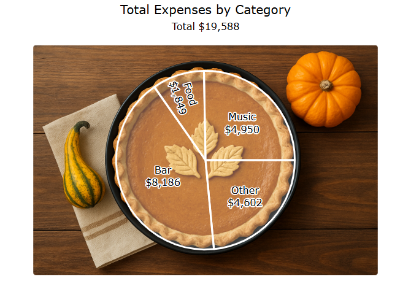

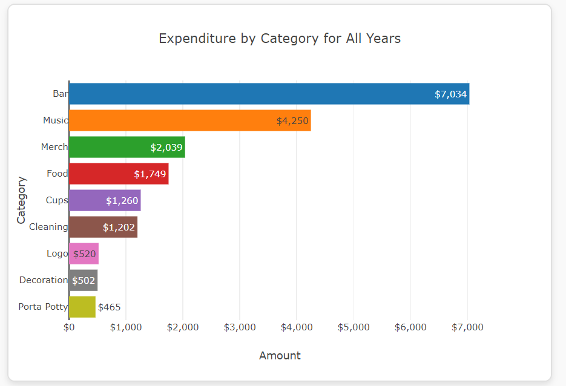

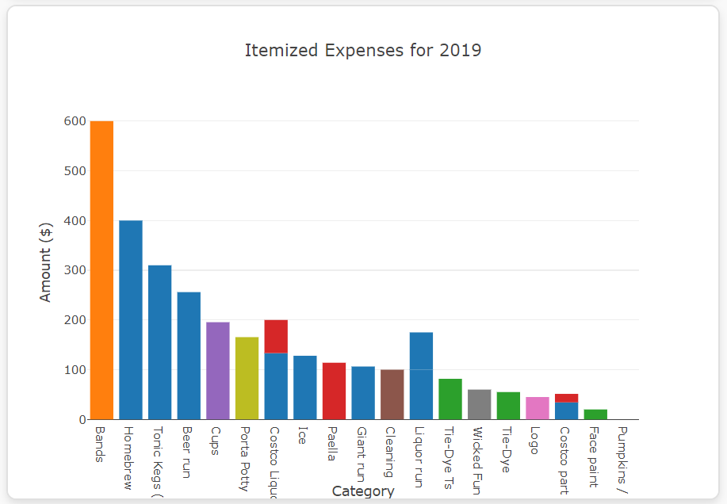

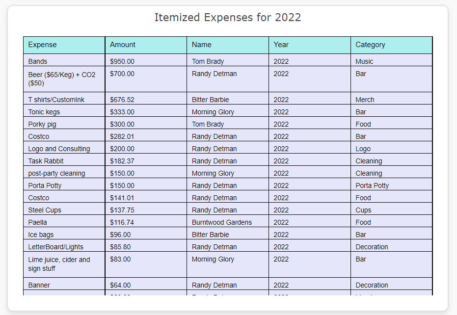

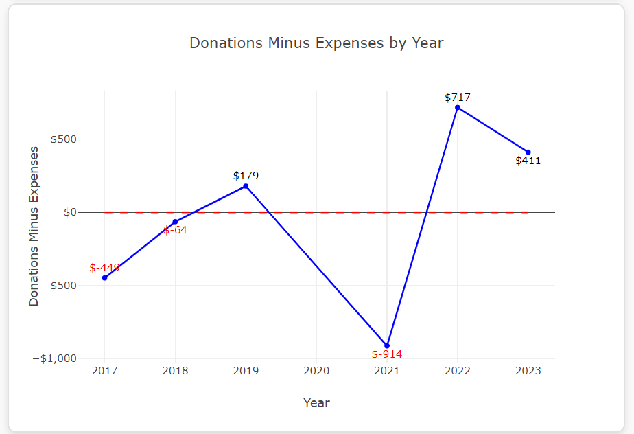

Sunburst chart (Pretty! And even more useless than a pie chart):

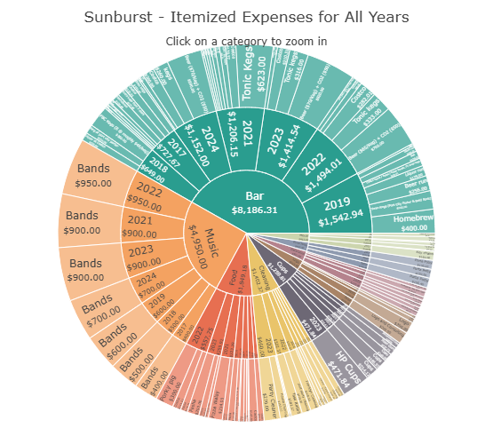

2020 gag:

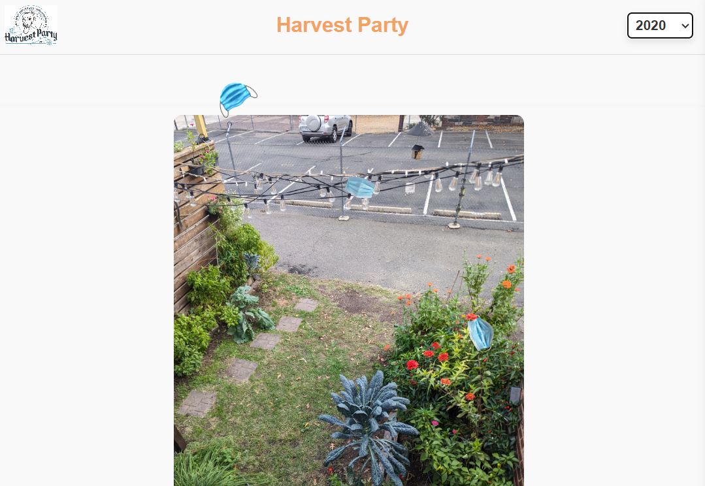

Tableau Story:

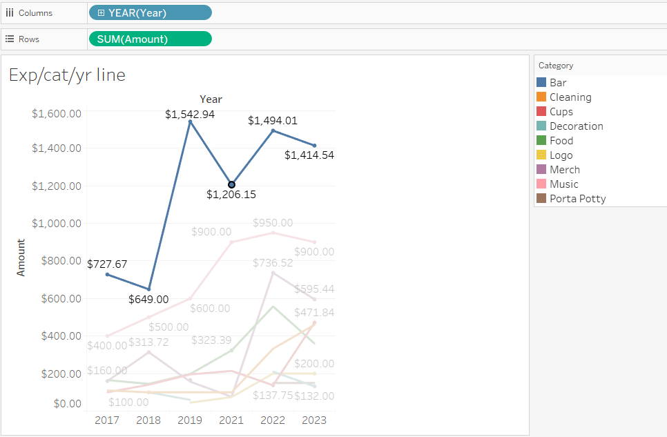

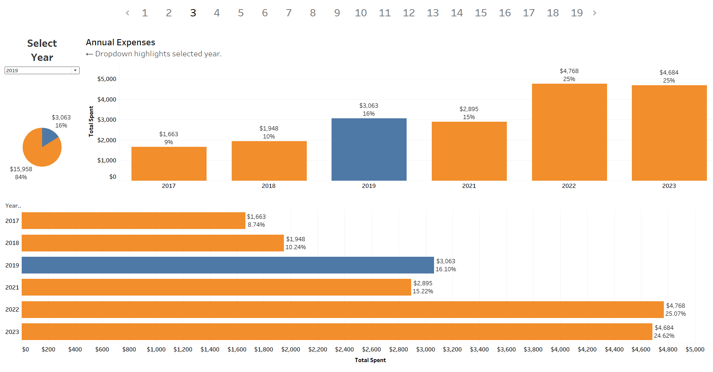

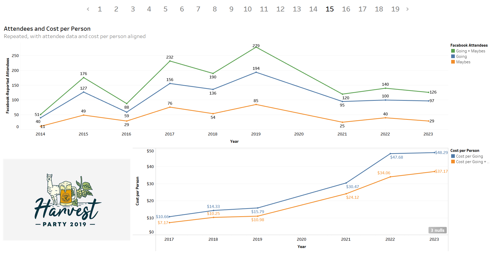

Exploratory Data Analysis:

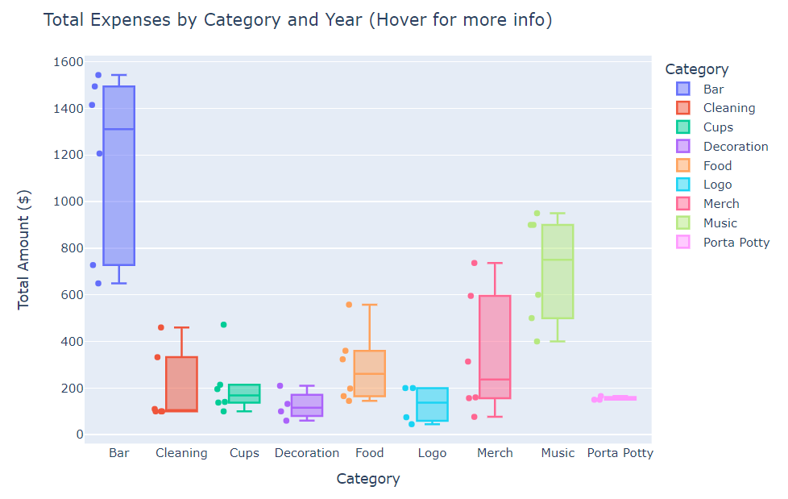

Photos & Logos:

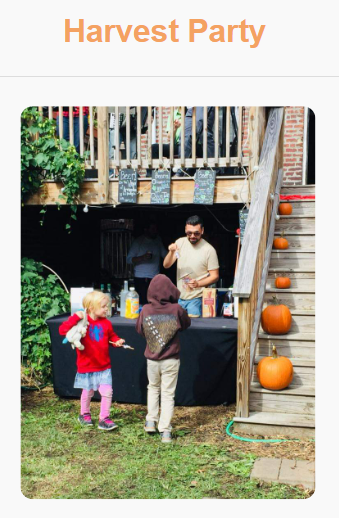

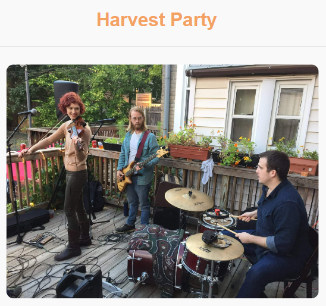

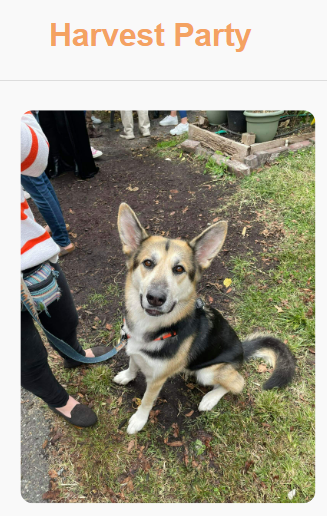

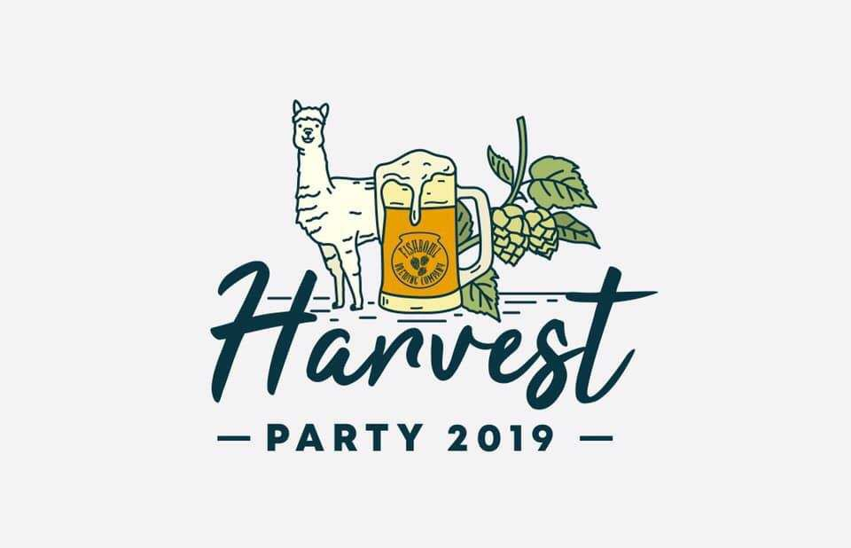

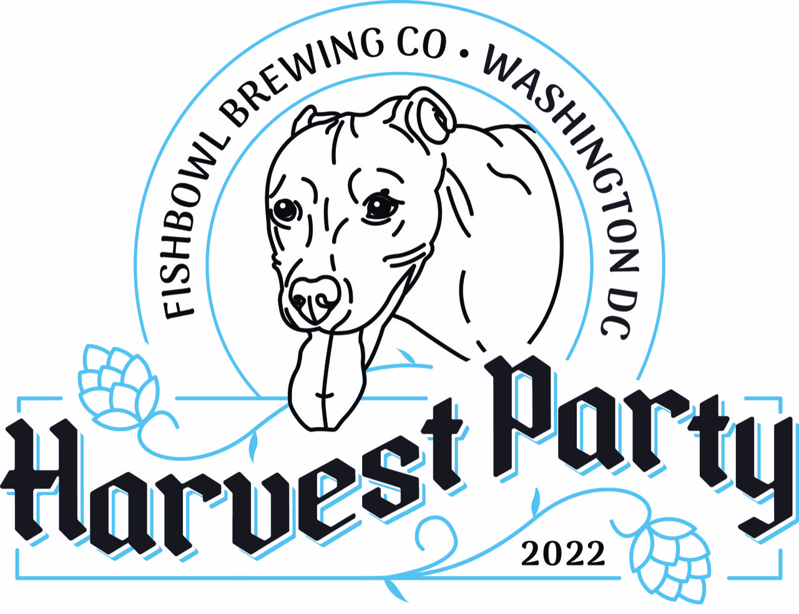

## Course Certificate

Final project for [cs50x](https://cs50.harvard.edu/x), "Harvard University’s introduction to the intellectual enterprises of computer science and the art of programming." The free online version, not the prestigiously priced in-person version.

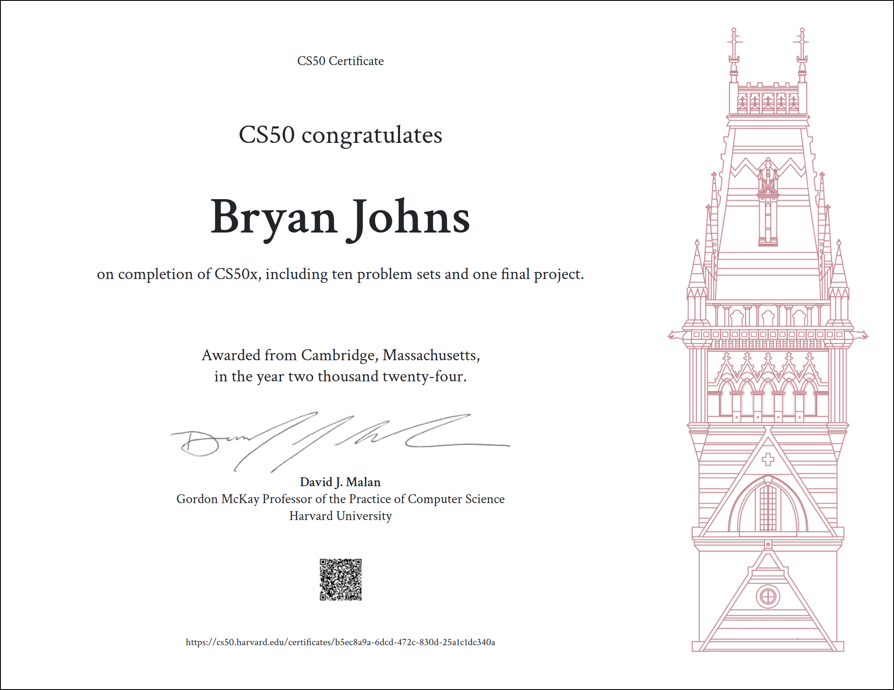

## References

Data supplied by the Harvest Party planning committee.

## Acknowledgements

- Huge thanks the cs50 team for helping this autodidact learn to code
- Shoutout to the Harvest Party planning committee, Randy Detman, Tom Brady, Watsonville, Morning Glory, and Bitter Barbie
- And to everyone who’s ever raised a glass or made a memory in the backyard—cheers 🍻

## Author

Bryan Johns, September 2024  
Revised October 2025  
[bryan.johns@informedwanderer.com](mailto:bryan.johns@informedwanderer.com) | [LinkedIn](https://www.linkedin.com/in/b-johns/) | [GitHub](https://github.com/johbry17) | [Portfolio](https://informedwanderer.com)  
— Fluent in Data. Fluent in Human.

