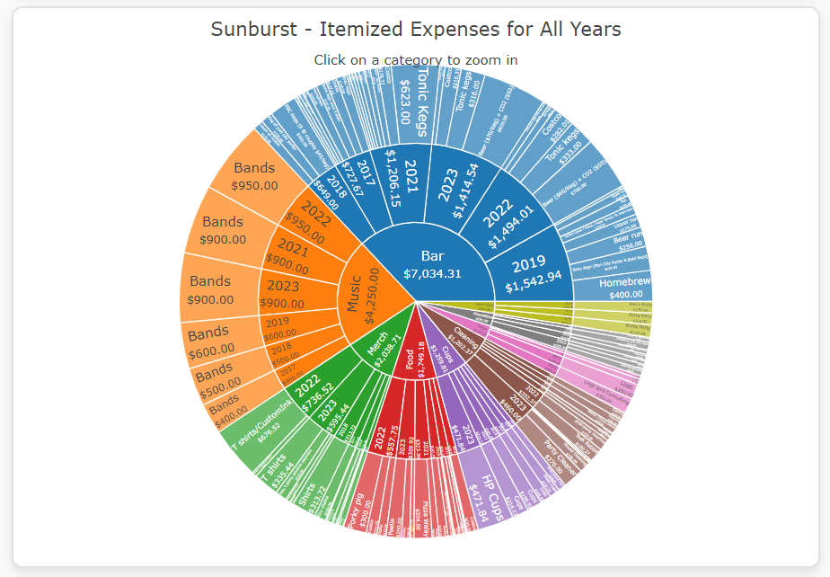

# Harvest-Party
Data analysis and interactive visualizations for an annual fundraiser for the [Capital Area Food Bank](https://www.capitalareafoodbank.org/) in Washington DC.

## Table of Contents

- [Description](#description)
- [Usage](#usage)
- [History](#history)
- [Gallery](#gallery)
- [References](#references)
- [Acknowledgements](#acknowledgements)
- [Author](#author)

## Description

A Python Jupyter Notebook exploratory data analysis of the finances of an annual fundraiser, followed by an explanatory data analysis in Tableau, designed to ensure fiscal transparency for stakeholders and to encourage donations. Accompanied by a website for public outreach.

Names have been changed to protect the guilty. This is a fun project.

## Usage

I posted the [exploratory data analysis to Google Colab](https://colab.research.google.com/drive/123nofMYi7z7l8IldtLYO9ns2wDWzKHCE?usp=sharing), as some of the hover info from Plotly will not render on GitHub, because GitHub only hosts static web content. You can see the same `exploratory_data_analysis.ipynb` here in the root directory.

The website is hosted here on GitHub Pages, under the domain name [harvestpartydc.com](https://www.harvestpartydc.com/). It is under active development, but version 1.0 is ready to go. The visualizations are interactive and contain lots of extra information on hover or click. I'm still ironing out some of the formatting kinks for mobile display. For example, the line plot of "Expenses by Category Over Time" should toggle between an individual category, displaying only that category's expenditure per year while dimming the rest, but it's fickle in functionality, not always displaying amounts, or working at all on mobile.

The Tableau explanatory data analysis is under active development. Progress can be viewed [here](https://public.tableau.com/app/profile/bryan.johns6699/vizzes). 

## History

The original data is in a chaotic Google Sheet:

The first task was to clean and organize the data, eliminating the flotsam and jetsam.  I made a copy of the dataset, removed extraneous information, and standardized the purchase date to reflect only the year. Then, I manually categorized the data:

I also created separate sheets for donations per year, attendees per year (based on Facebook, an increasingly irrelevant metric), and reimbursements to individuals who purchased items. All of these were exported as CSV files.

Using a Git-ignored script, I assigned pseudonyms to participants and merged the individual years into a single expense CSV. The script is dynamic and will work for future years unless new names are added.

For the exploratory data analysis (EDA), I performed minimal data wrangling. Using regex, I stripped '$' and ',' from the data, converted all currency to floats, renamed a few columns, and removed a few nulls from the donations. I also reallocated the "Costco" category, assigning 1/3 to Food and 2/3 to the Bar.

I then created various plots, honing my skills in Seaborn and Plotly along the way. The results were unsurprising: costs have increased due to inflation (e.g., rising musician and house cleaning costs) and the addition of new features to the event (e.g., better logo design, cleaners on the day of the event).

I cleaned up the EDA, adding comments on my thought process and the value (or not) of relevant charts, and then posted it to Google Colab, to allow viewers to interact with Plotly's dynamic content.

The EDA helped me brainstorm what I wanted to put into Tableau and the website.

I built the website to be hosted by GitHub Pages. Building a server side for this project would have been overkill.

The visualizations are designed to effectively communicate how funds were spent and how much has been donated. They display both individual years and cumulative data for all years, including an estimate of the cost per attendee, despite the growing unreliability of Facebook metrics. The goal is to engender trust and encourage continued donations, as well as trim the budget in future years.

I put a lot of thought into the presentation of the information, rounding off numbers in some cases and often choosing not to display them to reduce the data-to-ink ratio. I used Plotly's hover tools to provide that information if desired, as most casual viewers will likely access the website on mobile. I maintained a consistent color scheme for all visualizations to enhance understanding, even though I would have preferred to use a solid blue for some visualizations, like the initial "Expenditure by Category" plot. However, it would have been confusing to use color coding in some visualizations and not others. I also included a sunburst chart for fun because it is pretty and interactive, although I remain skeptical about its future utility in communicating data insights. I don't even like pie charts. Fun fact: I programmed all the numbers to display according to the viewer's locale, ensuring that regionally appropriate punctuation is used for the thousands and decimal separators.

Included is an image carousel that rotates through pictures from the fundraiser, or displays the logo of a chosen year.

The email form is handled by Formspree, delivering submissions to the email address harvestparty313@gmail.com.

I am generally satisfied with the code, although the visualizations could be more efficient. For instance, the math, traces, and layout for many could have been abstracted into separate functions, but I wanted to be able to toggle them on and off with ease.

The Sass, however, is a nightmare of inefficiency, having evolved clumsily as I tackled each element. I know I could have streamlined it. I underestimated the amount of styling needed and how repetitive it can get. Variables and mixins are the future. This is my first major styling project in CSS, and I never want to do it again. Mobile-responsive CSS is officially Nightmare Fuel, and I need Brain Bleach. I would very much like to return to my peaceful little data science Jupyter Notebooks now.

The website does contain a few extra flourishes. For example, the homepage logo randomly selects one of the available logos on reload, and the 2020 page features an empty party venue with a few blue safety masks rolling across the screen—a nod to the year the fundraiser was canceled due to COVID-19.

Future tasks include consulting a graphic designer to improve the aesthetics of the website and adding efficiency enhancements, like preloading images, lazy loading for the image carousel, and caching fetched data in the browser's localStorage or sessionStorage. I might also add a dark mode, subtle animations, or custom icons. Projects never end.

The Tableau explanatory data analysis is under active development for a mid-September meeting of the Harvest Party committee.

Based on the results, the Harvest Party planning committee is already working on ways to scale back costs to increase the impact of all donations this year.

## Gallery

Pictures from the image carousel:

Website plots:

Exploratory Data Analysis:

Coming soon: Tableau

## References

Data supplied by the Harvest Party planning committee.

## Acknowledgements

Much gratitude to the cs50 team, for helping this autodidact learn to code.

Special thanks to the Harvest Party planning committee, Randy Detman, Tom Brady, Watsonville, Morning Glory, and Bitter Barbie.

And to all of the attendees of Harvest Party, past and future.

## Author

Bryan Johns, September 2024
